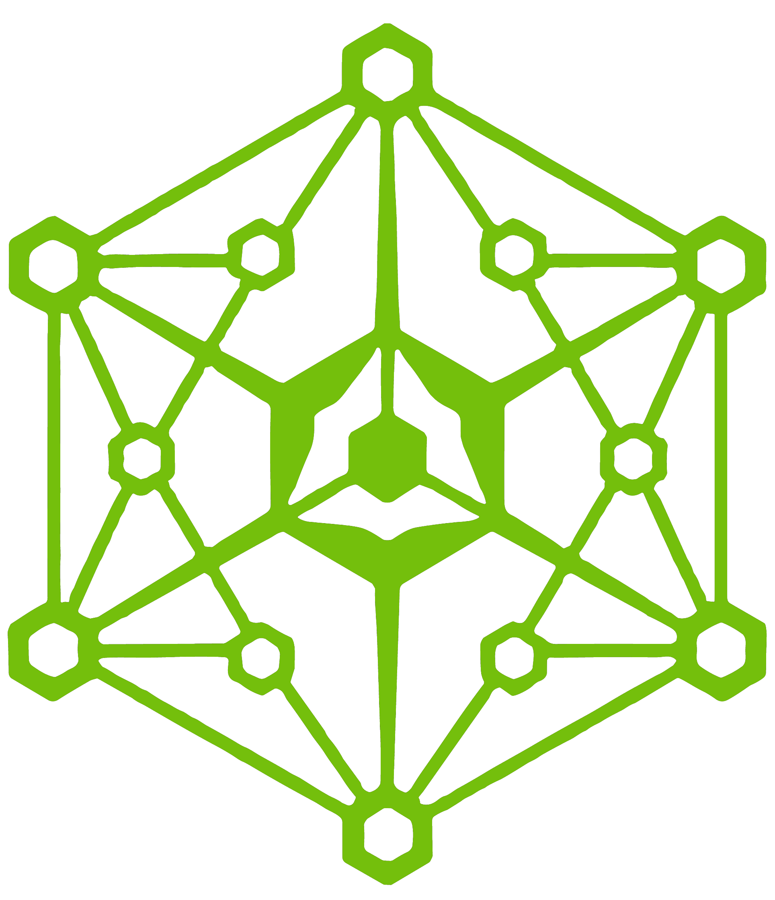
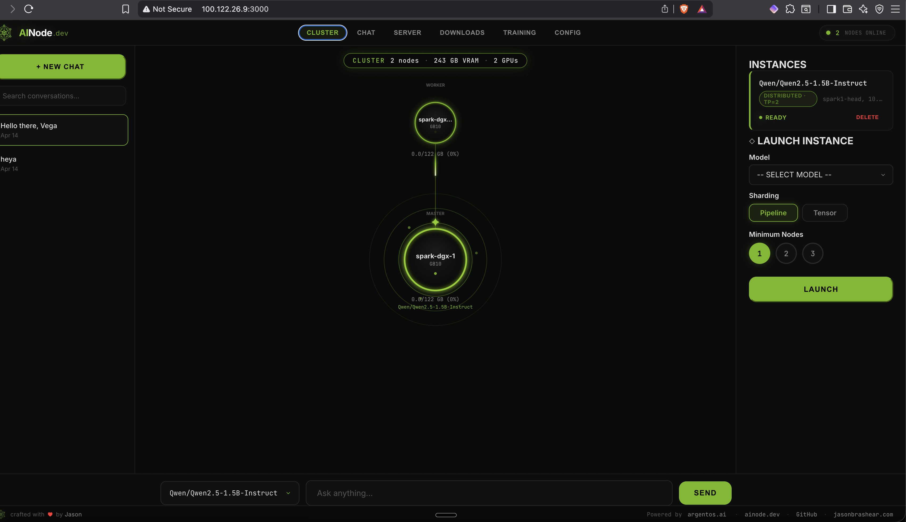
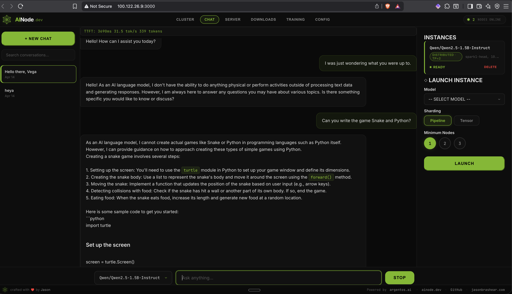
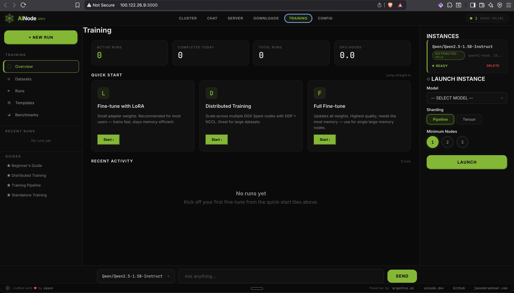

<div align="center">



# AINode

### Turn any NVIDIA GPU into your local AI platform.

Chat, API, and fine-tuning in your browser. One command to start.
Automatic multi-node clustering. Apache 2.0.

<br />

[](https://ainode.dev)
[](https://ainode.dev/install)
[](https://docs.argentos.ai)
[](https://www.apache.org/licenses/LICENSE-2.0)

[](#)
[](https://github.com/vllm-project/vllm)
[](https://www.ray.io/)
[](https://github.com/orgs/getainode/packages)

</div>

---

## Install in 30 seconds

```bash
curl -fsSL https://ainode.dev/install | bash
```

That's it. Pulls the unified container image, registers a systemd
service, and opens the chat UI at **http://localhost:3000**.

Distributed (multi-node) install:

```bash
AINODE_PEERS="10.0.0.2,10.0.0.3" curl -fsSL https://ainode.dev/install | bash
```

---

## What it looks like

### Distributed inference across two DGX Sparks



*Two DGX Sparks, one sharded model, 244 GB aggregated VRAM. NCCL over RoCE
at 200 Gbps on ConnectX-7.*

### Chat — streaming, OpenAI-compatible



### API console — LM Studio style, live request tap


### 50+ models — Hugging Face catalog, one click


### Fine-tune from the browser



### Cluster config — set TP / PP, pick the fabric, go


---

## Projects in this org

| Repo | What it is |
|---|---|
| **[ainode](https://github.com/getainode/ainode)** | Product source — CLI, API, web UI, engines, training |
| **[ainode.dev](https://github.com/getainode/ainode.dev)** | Marketing site at [ainode.dev](https://ainode.dev) |

### Container images (public on GHCR)

```bash
docker pull ghcr.io/getainode/ainode:latest        # runtime image (~18 GB)
docker pull ghcr.io/getainode/ainode-base:latest   # eugr base + CUDA 13
```

---

## Why this exists

Most "local AI" tooling bails out the moment your model is bigger than
one GPU. The moment you need two, you're writing Ray configs, debugging
NCCL, patching vLLM, and wiring SSH bootstrap — by hand, at 2 AM.

AINode bundles that entire stack into a single container and turns
multi-node inference into a UI checkbox:

- **Auto-discovery** over UDP on your cluster subnet
- **Tensor-parallel sharding** across every GPU the cluster sees
- **Ray head + worker** formation via eugr's launcher
- **NCCL over RoCE** when ConnectX-7 + RDMA are present
- **Graceful fallback** to single-node when the cluster shrinks

If you have one GB10 or ten of them, you run the same install
command, and the thing just adds up the VRAM.

---

## Built on giants

AINode doesn't reinvent inference — it composes the best OSS runtimes
and makes them boring to operate:

- **[vLLM](https://github.com/vllm-project/vllm)** — the inference engine
- **[Ray](https://www.ray.io/)** — cross-node orchestration
- **[NCCL](https://developer.nvidia.com/nccl)** — patched for 3-node ring on GB10
- **[eugr/spark-vllm-docker](https://github.com/eugr/spark-vllm-docker)** — the blessed GB10 base image
- **[Hugging Face](https://huggingface.co/)** — model catalog

---

## Status

v0.4.0 shipped (April 2026). Distributed TP=2 verified on real GB10
hardware. See the [full state-of-play](https://github.com/getainode/ainode#state-of-distributed-inference-april-2026)
in the product README — including what works, what doesn't, and the
lessons learned getting to "it just runs."

---

<div align="center">

**Powered by [argentos.ai](https://argentos.ai)** · Apache 2.0 · Made with NVIDIA GB10

<sub>If this saved you a weekend, <a href="https://github.com/sponsors/webdevtodayjason">consider sponsoring the work</a>.</sub>

</div>
